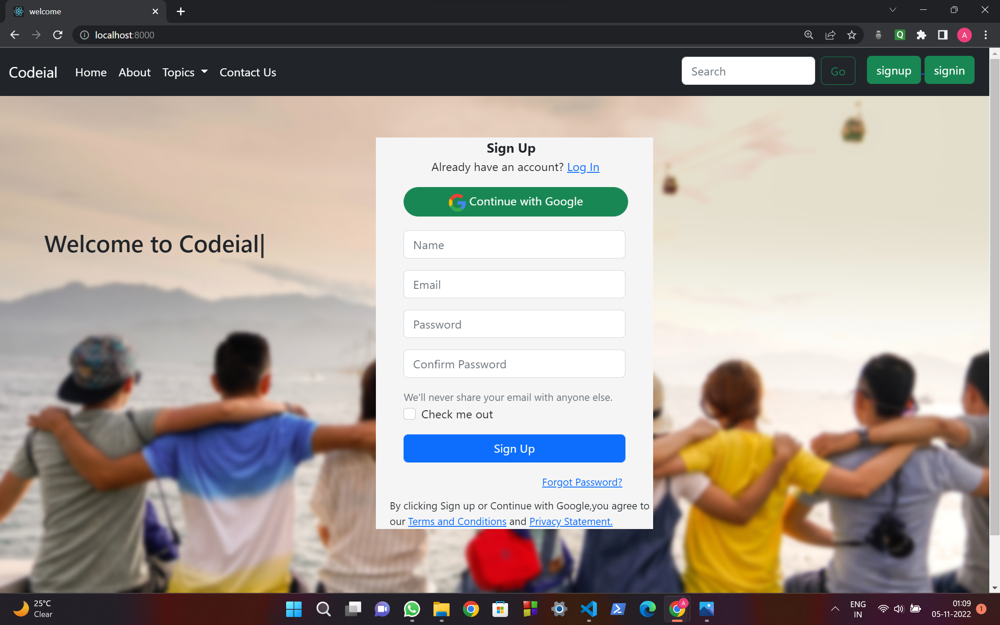
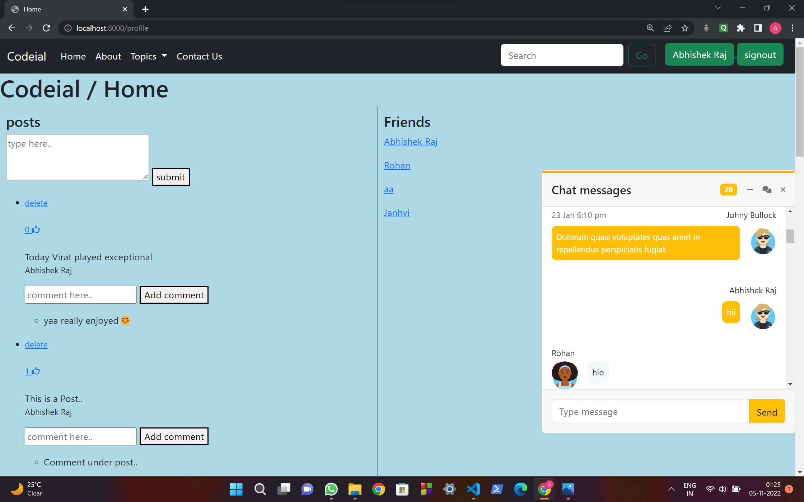
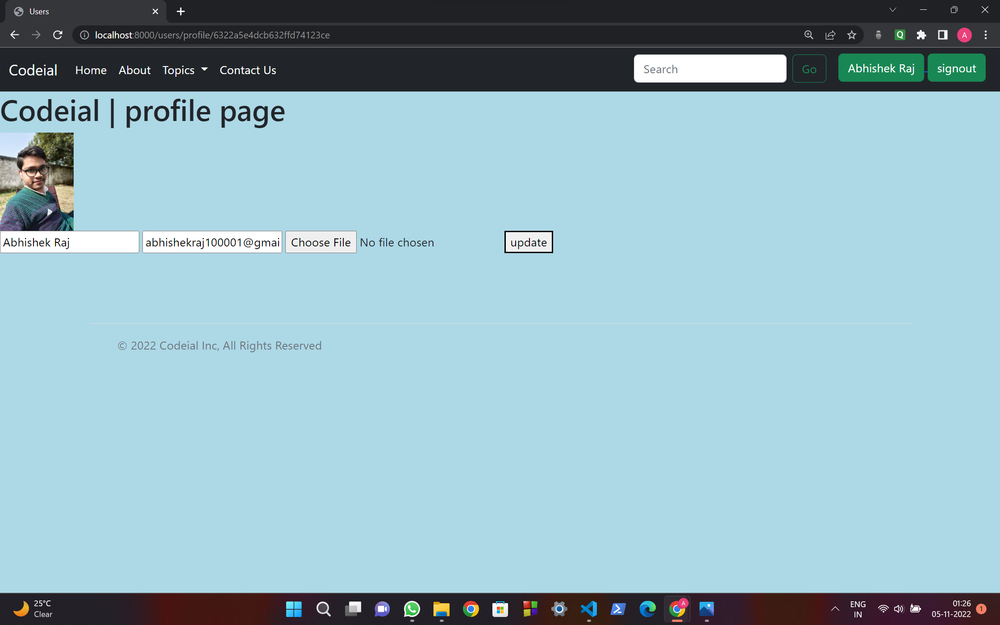
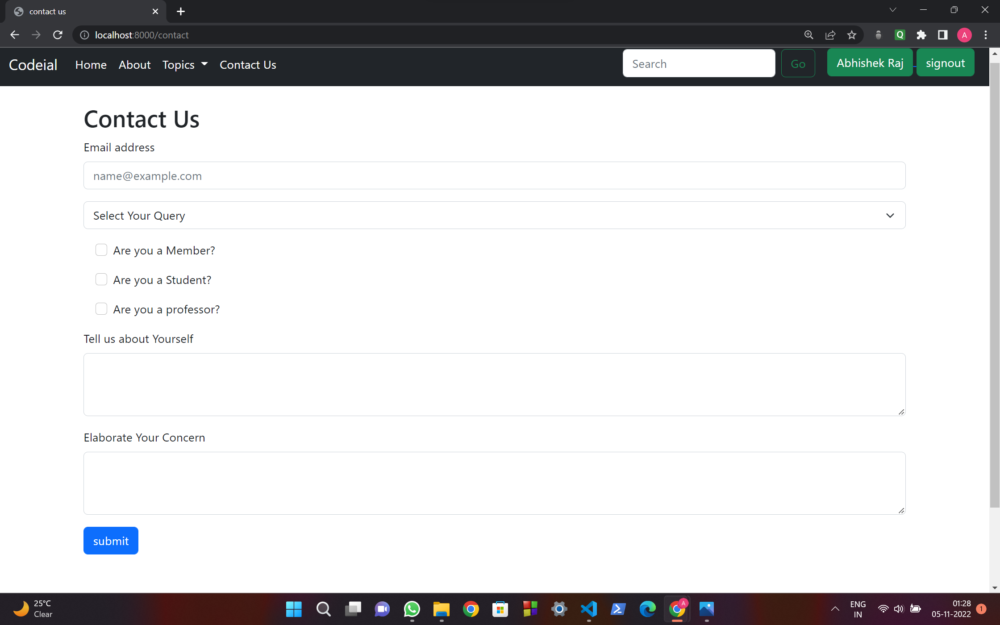

<!-- do Pull the code and 'npm install' and you are good to go. -->

# Codeial (A social Media Web App)

## Description

A social Media Web Application where a user can create his/her account and do Posts,Likes,Comments,Chat and many more stuff.

## Technology Used

- Nodejs + Express-Server
- MongoDB
- PassportJS (Local + OAuth)
- Redis-Server
- NodeMailer
- SCSS
- Socket.IO
- Que

## Features

- Login/Signup (using Google also)
- Add a Post/Comment
- Like a Post
- Forgot Password
- Mail your activities (post,comments)
- Upload Profile Picture
- Chat
- Flash Messages
- All the functionalities are added dynamically using AJAX so that the page does not reload upon every request

## Welcome Page



## User Home Page



## Profile Page



## Contact Us



- Clone this repository and then install dependencies using

```
   npm install
```

- start the server

```
   npm start
```

- visit your app at:

```
   http://localhost:8000
```
